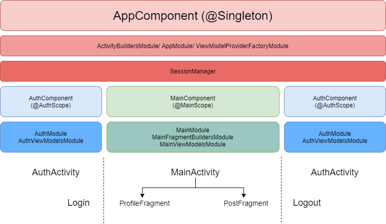

<h1 align="center">UserLogin App with Dagger2</h1>

This opensource project is a demonstration of how we can achieve UserLogin and control it's session using Dagger2 along with RxJava, LiveData, Retrofit2, MVVM architecture, Android Jetpack's Navigation component.

## Project Used:
* Android Studio 3.5.3
* Kotlin Version 1.3.40

